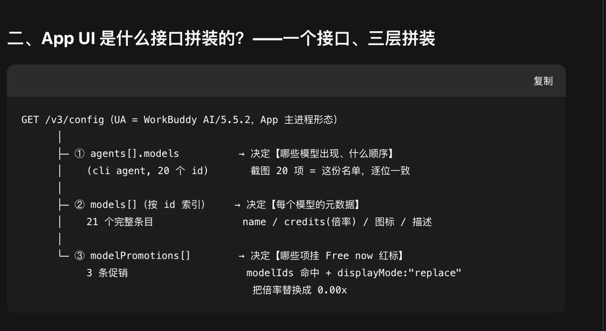
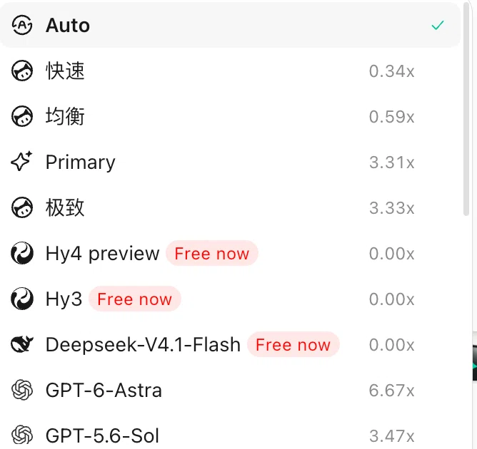
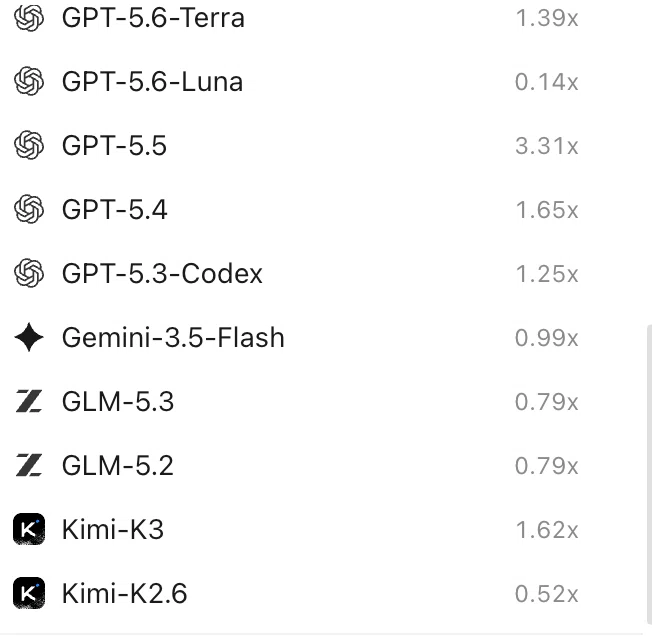
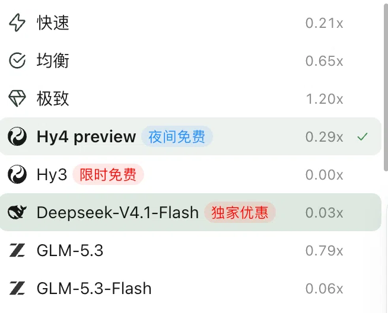
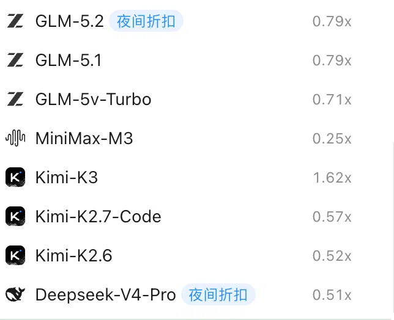
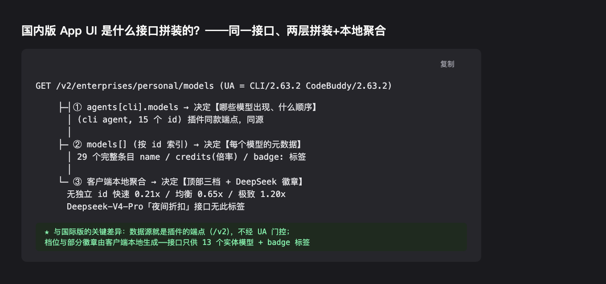

# WorkBuddy 两版（国内 / 国际）调用与兼容调研：客户端与上游实测

> 日期：2026-09-11（四轮：无积分账号 → 有积分账号 → 目录分片机制定位 → 两版 UI 对账，含国内版对照）
> 状态：调研完成，未做任何产品代码改动。
> 背景：issue #16（hackxmli，2026-09-11）请求兼容国际版，称「国际版4.1FLASH还免费」。
> 环境：本机装有国内版 App（WorkBuddy）与国际版 App（WorkBuddy AI），两版均已登录；第一轮账号为 0 积分，第二轮换有积分账号复测，第三轮用两版凭据做 UA 分流对照（§2.7）。

**口径**：

- 「实测」= 用真实凭据、经插件同款请求形态（`WorkBuddyUpstreamClient` / 相同头部）发起的最小化请求；收到首个 SSE 事件即中止，不等完整生成。
- refresh 端点两轮都**刻意未实测**：它会轮换 refresh token，可能扰动已登录 App 的会话。
- 今天的响应只是快照，上游随时可变（与 AGENTS.md 对 catalog 快照的口径一致）。
- token 等敏感值不入文。


**执行摘要（先读）**：

- **产品方向已定**：国际版 = 独立 provider（`workbuddy-ai` / 组名「WorkBuddy AI」）+ 独立设置卡片，模型列表与积分各自分组（§1）。
- **两版调用地图**：目录/chat/刷新/积分四个接口两版同构，仅基址与目录路径不同（§2.1）；目录端点**不做 UA 门控**（§2.7.5）。
- **App UI 拼装机制已完整还原**：国际 App 选择器 = `/v3/config`（UA 门控）三层拼装（§2.7.4）；国内 App 选择器 = **插件同款 `/v2` 端点** + 客户端本地聚合（§2.7.6）——国内侧与插件天然同源，无缺口。
- **国际版目录两个候选方案（开放评估）**：A = 维持 CLI 端点（稳定、促销已有，少 2 模型）；B = 从 UA 取 App 面文档（与 App 用户目录同源同构、数据更富，代价是绑服务端私有 UA 判据 + 合规未验证）——两版逻辑差异大，国际 App 面在变厚，B 是正式候选，不预判（§2.7.9）。
- **待拍板**：provider 可见性三形态（倾向②，§1.1）；国际版目录方案 A/B（开放，§2.7.9）。
- **调研执行记录**：本会话中 `~/.dsh/AGENTS.md`（用户全局规则，软链自 `~/.zcode/AGENTS.md`）生效；文档本身的入库决策待定。

## 1. 兼容方向（已定：独立 provider + 独立卡片）

**先读这里**：本节是产品/技术决策与落地路径；§2 起是支撑这些决策的实测证据链（两版调用地图、UA 分流机制、完整目录快照、UI 对账）。

产品决定（2026-09-11，用户确认）：国际版算**新 provider**，积分与模型列表分组单独；**设置卡片也是单独一张**——理由是两版登录的是**不同账号**，卡片各自展示自己的账号身份（昵称/uid）与积分余额，混在一张卡里说不清是哪个账号的余额。

这与代码核对的事实一致：账号身份（`auth.account.uid` / `nickname` / `enterpriseId`）与积分余额本来就是**每个凭据文件一份**（`workbuddy-desktop.info` vs `workbuddy-desktop-ai.info`，§3.1），独立卡片正是把这个边界在 UI 上也划清。

**卡片单独的具体含义**（对照本节参数化清单）：

- 现在的卡片是**每插件一张**（`client/index.tsx` 里 `slots.inject('settings.plugin.item', { key: 'workbuddy' })`，key 写死）。独立卡片意味着**同一插件注册两个卡片条目**，key 需拆成 `workbuddy` / `workbuddy-ai`（或类似），各自指向自己的 `statusPath` / `probePath`。一个插件能否在同一插槽注册两个条目**尚未验证**（现状每次 `apply` 注册一个 key），动手前先用最小用例验证；若不支持，走两个 client bundle 的路线。
- 每张卡各自渲染：登录态（`store.status()`，各自 store）、积分余额（各自 `fetchCredits`）、模型上下文栏、探测明细（各自 probe store——见下「缓存按 provider 隔离」）。
- 文案 locale（`settings.workbuddy` 命名空间）需要按卡片区分（组名「WorkBuddy」/「WorkBuddy AI」）。

代码探索结论（只读探查，未改代码）：

- 插件全是构造注入，「**一个 provider 一套 bundle**」可干净复制：credential store（探测路径、自留副本文件名、env 各一套）、catalog + 各自兜底目录、shim（随机端口 + 进程内密钥，一 provider 一个）、adapter（provider/displayName 参数化；`registerAdapter` 原生支持第二路由）、probe service/store。
- **模型选择器按 provider 自动分组，组名来自 `displayName` 而非 provider 字符串**（DSH 核心逐环核实）：`buildModelCatalog()` 取 `group.name = provider.name`（`dsh-host-apiproxy/lib/index.js`）← `ctx.llm.listProviders()` ← `adapter.providerInfo(provider)`（`dsh-llm`）← `PiAiAdapter.providerInfo()` 返回 `profile.displayName`（`dsh-llm-pi-ai/lib/index.js:1651`）← 插件 `ResolvedPiAiProviderProfile.displayName`（`src/adapter.ts`）。国内 `displayName: 'WorkBuddy'` → 组「WorkBuddy」；国际版用 `provider: 'workbuddy-ai'` + `displayName: 'WorkBuddy AI'` → 独立组「WorkBuddy AI」，与国内组并列——即用户预期「国际版的模型就在 WorkBuddy AI 组下，类似国内的在 WorkBuddy 下」。同名模型（`glm-5.3` 等）在两组下是两个独立选择项（提交 `{provider: group.id, model}`），不冲突；但这正是探测缓存必须按 provider 分文件的原因（`fingerprintModel` 不含 provider，见下）。
- 需要新增/参数化的点：status/probe 的 HTTP 路径（现为全局一对，`src/status-paths.ts`）、settings namespace（`workbuddy-ai`）、客户端卡片（**每 provider 一张**：插槽 key 拆成两个，组件参数化 `statusPath`/`probePath` 后复用）、Composer 探测入口（provider 判断从单值放宽为双值、按 provider 取路径）、CLI `status`/`doctor`/`logout` 加 provider 维度。
- 区域路由（`regionOf`/`GLOBAL_BASE`）v0.1.0 起就有，不用动；模型目录路径按区分流即可（cn 保持 `/console/...`，global 用 `/v2/enterprises/...`，两者均已实测 200）。**注意**：国内 `console` 在国际版返回 500，国际版须用 `/v2/...`（§2.7.5 已两版实测）。
- 错误分类：`HARD_CREDIT_MARKERS` 补 `credits exhausted`（§2.3）。这条与国际化无关、国内 402 走 `status===402` 分支所以一直未暴露，可独立先修。
- **缓存须按 provider 隔离**（代码核对）：`WorkBuddyProbeStore` 是**单文件** `.workbuddy-probe.json`，记录**只按模型 id 索引**（`records[modelId]`），唯一保护是 fingerprint——而 fingerprint 只含 `id` + `reasoning` + `supportsImages`，**不含 provider/region**。两版同名模型（`glm-5.3`/`glm-5.2`/`hy3`/`kimi-k2.6` 等，§2.2）若声明一致，探测结果会互相串。`WorkBuddyProbeStore` 构造函数**已收 `path` 选项**，第二 provider 传不同路径即可，成本极低。这是 provider 独立的设计要求，不是 bug 修复。

### 1.1 决策：provider 可见性与注册时机（待用户拍板）

**规则（用户 2026-09-11 确认预期）**：极端情况下只装国际版、没装国内版的用户，DSH 里就应**只看到「WorkBuddy AI」组**；反之亦然。即——**每个 provider 的可见性都独立跟随自己的凭据**，与另一个 provider 装没装无关。国内 provider 今天的「默认在册」是历史产物，不是规则本身；规则是「有该版凭据（或曾经有过——own 副本仍在，`src/auth.ts` 的 `current()` 会取两者中较新者）→ 该 provider 在册」。

**host 侧行为已核实（两条硬保证）**：

1. **空目录的组会被自动丢弃**——`buildModelCatalog()` 末尾 `groups.filter(group => group.models.length > 0)`（`dsh-host-apiproxy/lib/index.js`）。没有模型的 provider 不会在选择器里留下空组。
2. **单 provider 失败不影响其他组**——注释原文 "Per-provider failures ride `failures` without failing the sound groups"。一个 provider 目录加载报错只进 `failures`，另一组照常渲染。

由此，「不注册」与「注册了但目录为空」**在选择器里等效**。三种落地形态：

| 形态 | 做法 | 优点 | 代价 |
|---|---|---|---|
| ① 按凭据存在性注册 | `shim.ready.then` 分支里一次 `stat` 判 `-ai` 凭据（desktop 文件或 own 副本），不存在则跳过 `registerAdapter` + `registerConfigurableProviders` | 没装的人最干净；装了但 token 过期的人仍能看到卡片去修登录 | 注册是**开机一次性**（`src/index.ts` 的 `void shim.ready.then(...)` 内注册，之后只有 disposal，无重注册路径）——用户**启动 DSH 之后才登录** App 时，provider 不出现，需重启 |
| ② 始终注册、目录为空 | 无凭据时 `catalog.current()` 返回空数组（兜底目录改为「仅在有凭据时生效」） | **登录后第一次目录刷新即出现**，消解形态①的重启限制；不动注册时序 | **国内 provider 现状变化**：今天无凭据也显示 15 个兜底模型，改后不显示 |
| ③ 动态重注册 | 凭据出现/消失时 `handle.replace()` 或重新注册 | 语义最精确 | 需新拆「凭据变化探测」机制（无文件监听，得轮询或挂卡片轮询），成本最高，收益相对②不明显 |

**插件建议：形态②，并把「空目录」语义收紧。** 理由：

1. **一次解决三件事**——可见性对称（本节规则）、「启动后才登录需重启」的时序限制（形态①的硬伤）、以及兜底目录的语义纯度（见下）。
2. **兜底目录的语义反而变准了**。今天 `catalog.ts` 的注释写着 "The static fallback catalog serves from the first moment, so an offline upstream never leaves the provider empty"——它是为「**有凭据但上游离线**」设计的；但现状是无凭据也顶出 15 个模型，用户选了必报错（`store.resolve()` 抛 "no signed-in WorkBuddy account found"），这正是「必然报错的模型」的国内版翻版，只是没人投诉过。收紧后兜底只服务它原本想服务的场景：**有凭据 + 离线 → 用兜底顶住；无凭据 → 空组**。语义从「永远不空」变成「该空则空」。
3. **行为变化可控且可写进 changelog**：受影响的只有「装了插件但从未登录 WorkBuddy」的少数用户（本就该看到报错引导而非可点但必败的模型列表）；README 与 Release 备注写明即可。
4. **不引新机制**：不碰注册时序、不加文件监听/轮询，改动收敛在 catalog 的空目录判断与两版兜底装配条件，风险面最小。

**需要用户确认的点**：

- 形态②会改变国内 provider 的现有行为（无凭据不再显示 15 个兜底模型）——这是唯一的行为回归，是否接受？
- 形态②下「有凭据但 token 全过期」时目录仍显示（凭据文件在），请求时报错引导——这个边界是否符合预期？（形态①的 stat 判存在性同样如此，两形态一致。）
- 若将来出现「启动后才登录且不想重启」的强需求，再升级到形态③，现阶段不为它预付成本。

> 决策记录：〔待定〕——倾向方案为②，等待用户拍板。


## 2. 上游实测

### 2.1 端点矩阵

| 接口 | 国内版（插件在用） | 国际版实测 |
|---|---|---|
| 模型目录 | `GET copilot.tencent.com/console/enterprises/personal/models` | 同路径 **500**（openresty，换 UA 无关——路径不存在）；正确路径 **`GET www.workbuddy.ai/v2/enterprises/personal/models` → 200**。国内端点对新路径**也返回 200**（15 个 cli 模型，两路径并存） |
| chat | `POST /v2/chat/completions` | **同路径**；鉴权通过（无 401/403，`X-Product: SaaS` 被接受）；详见 §2.4 |
| 积分 | `POST /v2/billing/meter/get-user-resource`（`p_tcaca`） | **200**；0 积分账号返回 total 0，有积分账号返回真实余额（§2.5） |
| 刷新 | `POST /v2/plugin/auth/token/refresh` | **未实测**（避免轮换 refresh token）；代码确认国际 CLI 用 `` `/v2${prefixPath}/auth/token/refresh` ``，prefixPath=`/plugin`，**与国内一致** |

响应信封（`code/msg/data` + `agents[].models` + `models[]`）与国内同构；插件 `fetchModels` 依赖的字段（`credits`、`supportsImages`、`reasoning.supportedEfforts`、`maxInput/OutputTokens`）全部在场。

### 2.2 国际版 live 目录（cli agent，18 个模型，两账号快照一致）

| id | 名称 | 倍率 | 图片 | 推理档位 |
|---|---|---|---|---|
| default-model | Auto | x0.79 | ✓ | 未声明 |
| fast-model | Fast | x0.34 | ✓ | 未声明 |
| balanced-model | Balanced | x0.59 | ✓ | 未声明 |
| primary-model | Primary | x3.31 | ✓ | 未声明 |
| deep-model | Deep | x3.33 | ✓ | 不支持 |
| **hy4-preview** | Hy4 preview | **x0.00** | ✓ | [high] |
| **hy3** | Hy3 | **x0.00** | ✓ | [low, high] |
| gpt-5.6-sol | GPT-5.6-Sol | x3.47 | ✓ | 5 档全 |
| gpt-5.6-terra | GPT-5.6-Terra | x1.39 | ✓ | 5 档全 |
| gpt-5.6-luna | GPT-5.6-Luna | x0.14 | ✓ | 5 档全 |
| gpt-5.5 | GPT-5.5 | x3.31 | ✓ | [low…xhigh] |
| gpt-5.4 | GPT-5.4 | x1.65 | ✓ | [low…xhigh] |
| gpt-5.3-codex | GPT-5.3-Codex | x1.25 | ✓ | 未声明 |
| gemini-3.5-flash | Gemini-3.5-Flash | x0.99 | ✓ | 未声明 |
| glm-5.3 | GLM-5.3 | x0.79 | ✓ | [low, high, max]（与 live 国内新值一致） |
| glm-5.2 | GLM-5.2 | x0.79 | ✓ | [high, xhigh] |
| kimi-k3 | Kimi-K3 | x1.62 | ✓ | 未声明 |
| kimi-k2.6 | Kimi-K2.6 | x0.52 | ✓ | 未声明 |

- GPT-5.6 系为国际版独有；`glm-5.3`/`glm-5.2`/`hy3`/`hy4-preview`/`kimi-k2.6` 两边都有（**模型 id 跨版本撞名**，实现时缓存/目录必须按 provider 隔离）。
- 国际版**没有任何 `badge:` 标签**；有非徽章的普通标签（如 `craft`），现有徽章解析逻辑会正确忽略。
- issue 说的「4.1 FLASH」**不在 cli agent 目录里**——它属于 App 聊天界面的目录（§2.6/§2.7：来自 `/v3/config` App 面文档，实测 chat 网关可用）。
- 两个不同账号（0 积分 / 有积分）拉到的目录完全一致，未见账号级差异。
- 本端点响应**带 `modelPromotions` 字段**（国内端点无）：hy3、hy4-preview 各一条「Free now」促销（factor 0、`displayMode: replace`、带 Asia/Shanghai 生效窗口）。现有插件徽章逻辑解析的是 `badge:` 标签，不认这个字段——国际版要做「限时免费」展示需解析 `modelPromotions`（数据就在插件在用的这个端点里，无需换 UA）。

### 2.3 错误体差异（兼容点）

- 积分耗尽（0 积分账号实测）：**HTTP 429**（国内走 402 或文案标记），body 为嵌套形 `{"error":{"data":{"code":14018,"msg":"Credits exhausted. …"}}}`。
  现有 `classifyUpstreamError` 不会命中——标记表里是 `credit exhausted`（单数），实际文案是 **Credits exhausted**（复数），于是 429 被归为 `soft_rate`（可重试限流）而非积分耗尽。修法方向：`HARD_CREDIT_MARKERS` 增加 `'credits exhausted'`（对原始 body 文本匹配即可，不必解析嵌套结构）；`14018` 是否作为固定判据待观察，不预设为协议承诺。
- 缺 system 消息（§2.4）：**HTTP 400 `code 11128 "first message is not system prompt"`**。注意国内版的 11128 文案是 "Illegal API invocation from an unapproved channel"（拒 developer role）——**同一个错误码、两边语义不同**，不要按 code 单独分支。
- 模型参数下限（GPT-5.6 系，§2.4）：**HTTP 400 `code 11133` + `extError.code "integer_below_min_value"`、`param "max_output_tokens"`**。

### 2.4 chat 链路（第二轮，有积分账号）

用插件构建产物的 `WorkBuddyUpstreamClient.chatStream` + `prepareChatBody`（即生产代码路径）实测：

| 请求 | 结果 |
|---|---|
| `hy4-preview`，仅 `[{user,"hi"}]`，max_tokens 1 | **400 / 11128 "first message is not system prompt"** |
| `hy4-preview`，`[{system},{user}]`，max_tokens 1 | **200 + `text/event-stream`**，标准 `chat.completion.chunk` |
| `hy4-preview` 同上 + `reasoning_effort: "high"`（其声明档位） | **200 SSE**，档位透传无报错 |
| `gpt-5.6-luna`，max_tokens 1 | **400 / 11133 `integer_below_min_value`（param `max_output_tokens`）** |
| `gpt-5.6-luna`，max_tokens 16 | **200 SSE**；首 chunk `"object":"response"`（Responses API 网关包装，与 `chat.completion.chunk` 形状不同） |

结论与兼容点：

1. **SSE 流式端到端验证通过**（含免费与付费模型、含 reasoning_effort 透传）。
2. **国际版上游强制第一条消息是 system**。插件常规流量由 pi-ai 携带 system（developer→system 改写后），正常场景不受影响；但没有 system 消息的请求会被 400。是否要在国际版 shim 里兜底注入空 system，留待实现时决策。
3. **GPT-5.6 系有 `max_tokens` 下限（16 通过、1 拒绝）**。正常使用不会发 max_tokens=1，但探测（probe）协议的最小请求会踩到——国际版探测payload需按下限调整或逐模型探测时识别此错误。
4. GPT-5.6 的 chunk 形状是 `"object":"response"`，pi-ai 的 openai-completions 解析器对**完整流**的兼容性未验证（本次只读了首 chunk 即中止）——真机接入后需完整跑一轮。
5. 积分门卫在模型计费**之前**：0 积分账号连 x0.00 模型也被 429 拦；有积分账号 x0.00 模型正常通过。「免费模型是否完全零余额可用」在换号后已无法复测（不再有 0 积分账号），按已知证据：**需要过账号级积分门卫**。

### 2.5 积分（第二轮）

- 插件 `fetchCredits`（零改动）正确解析有积分账号：`total=350`，两个包 `Bonus Pack 250/250`、`Free Plan Subscription 100/100`。**有积分账号的余额显示验证通过**。
- 一次 x0.14 付费最小请求（max_tokens 16，读到首 chunk 中止）前后余额均为 350，**未见即时扣费**——计费大概率异步/批量，或按消息粒度四舍五入。扣费粒度与到账时延未验证，不影响接入。

### 2.6 App 界面模型与隐藏目录（deepseek-v4.1-flash 实测）

App 聊天界面的模型选择器（用户截图）里有 **Deepseek-V4.1-Flash（0.00x + Free now 红标）** 和 **GPT-6-Astra（6.67x）**，两者都不在 cli agent 的 18 个模型里——App 聊天面用的是另一份目录/促销源（**第三轮已定位：`/v3/config` App 面文档，§2.7**；当时只知道不是 CLI 这份）。`repos[]` 查询参数变体（`chat`/`all`）也不改变返回的 18 行。

**这份 App 面目录不是写在客户端里的**（2026-09-11 查证）：两个 id 在国际版 App 安装包内（`app.asar` 全文 + CLI `product.json`）零命中；而 asar 中存在运行时取数代码——`product.availableModels` / `product.modelGroups` / `product.modelPromotions`（pick 自服务端下发的 product 文档）。即 App 也是运行时从自己的控制台 API 拉目录与促销，只是该接口不认 CLI 的 Bearer（早前矩阵里 `/console/api/enterprises/personal/models` 返回 403 `access_denied/not_authorized`——路径存在，需要 App 会话/授权面）。CLI 自带的 26 条静态兜底（product.json）同样不含这两个模型。

**结论（2026-09-11 第三轮已定论）：模型目录确实按「界面」分片下发，实现手段是 `GET /v3/config` 按 `User-Agent` 分流。**详见 §2.7——第三轮定位到了取数调用点、复打验证成功，并做了国内版对照。

第三轮之前只能站住的事实（保留作为推理链记录）：

- 已证实（客户端侧查证，2026-09-11）：两个 id 不在 App 安装包里；App 代码运行时从「product 文档」取 `availableModels` / `modelGroups` / `modelPromotions`。
- 已证实（线路侧）：CLI 端点返回的文档**没有** `availableModels` / `modelGroups` 字段——App 渲染选择器用的 product 文档不是 `/v2/enterprises/personal/models` 这份。
- ~~推断：「按界面分片」是一种解释；替代解释包括同一后端按 product 配置文档区分、或 App 端点只是多了参数/鉴权就能返回更多。~~ 第三轮实测否定了「参数/鉴权」这条替代解释：变量是**且仅是 UA**，鉴权头与 `X-Product` 两版人脸完全相同。

对插件的事实基线（不随目录方案选择变化）：以 CLI 身份、经插件端点能拿到的能力声明就是 18 个（见 §2.7.6）；App 面的 3 个增量模型是否纳入，属目录方案 A/B 的取舍（§2.7.9，开放评估）。

但 **chat 网关本身接受目录外的模型 id**，用插件生产路径（`chatStream` + `prepareChatBody`）实测：

| 请求 | 结果 |
|---|---|
| `deepseek-v4.1-flash`（system+user，max_tokens 16） | **200 SSE**，chunk 回显 `"model":"deepseek-v4.1-flash"` |
| `deepseek-v4.1-flash`，max_tokens 1 | **200 SSE**（无 GPT-5.6 系的下限限制） |
| 同模型 + `reasoning_effort: "probe_sentinel_x1"`（哨兵） | **400 / 11150** `invalid_reasoning_effort`——**参数校验型**，与国内 `deepseek-v4-pro` 同签名，插件探测协议对它有效 |
| 同模型 + `reasoning_effort: "off"` | **400 / 11150**（拒绝 off，同国内旧形模型） |
| 同模型 + `reasoning_effort: "low"` | **200 SSE** |
| `deepseek-v4-1-flash` / `deepseek-v4.1-flash-free`（拼写变体） | **400 / 11102** `model [x] service info not found`——上游自己校验模型 id，错误可判别 |
| `gpt-6-astra` | **500 / 11134** `the model provider is temporarily unavailable`——id 被识别（非 11102），当前供应商不可用 |

计费侧：多轮 deepseek-v4.1-flash 探测后余额仍 350/350，与 §2.5 一致（异步计费或免费期），**「Free now」无法从线路侧证明**，只能采信 App 展示。

插件含义（决策点）：

- 国际版 provider 的目录同步走 cli agent 列表（官方 CLI 的能力面），**不含** deepseek-v4.1-flash / gpt-6-astra。是否额外收录 App 面模型是产品决策；按「上游接受 ≠ 产品意图」的既有原则（PR #13 审查口径），**建议只收录 cli 列表**——它才是官方 CLI 自身暴露的能力面，App 面模型的目录与促销都不在 CLI 接口里，快照式收录很快会过期。（第三轮修正：促销**在** CLI 端点里有，见 §2.7；「只收录 cli 列表」的建议依据因此变弱，改为「插件端点不做 UA 门控」这条稳定性理由。）
- 若未来要做国际版「限时免费」徽章，数据源是 `modelPromotions`（带生效窗口与折扣），不是国内版的 `badge:` 标签。**插件当前端点已能拿到国际版的 `hy3` / `hy4-preview` 两条促销**（§2.7 表 C）。

### 2.7 目录分片机制定位（第三轮：两版 UA 对照）

> 方法：App 安装包静态取证（asar 索引解析 + 字节扫描定位命中文件）→ 读到取数代码 → 用两版真实凭据按 App 请求形态复打。
> 敏感值（token）不入文；刷新端点同前两轮，仍刻意未实测。

#### 2.7.1 取数调用点（静态取证，零风险）

在国际版 `app.asar`（20263 个条目、9146 个 JS）中定位到 product 文档的取数实现，位于 `main/tls-verification.js` 的 `fetchRemoteProductOverlay()`：

```js
const configUrl = product.config?.url ?? DEFAULT_REMOTE_CONFIG_PATH   // "/v3/config"
const endpoint  = this.productManager.getEndpoint()                    // product.json 的 endpoint
const xProduct  = ... ?? "SaaS"                                        // deploymentType
const fullUrl   = `${endpoint.replace(/\/+$/, "")}${configUrl}`
const res = await this.restOperations.get(fullUrl, {
  timeout: 5000,
  headers: {
    Authorization: `Bearer ${accessToken}`,      // 会话 access token
    "X-Product": xProduct,
    "X-Requested-With": "XMLHttpRequest",
    Connection: "close",
    // ← 无显式 User-Agent：由调用方的 HTTP 客户端带上
  },
})
```

- `DEFAULT_REMOTE_CONFIG_PATH = "/v3/config"`（该文件内定义），两版 `product.json` 的 `config` 都**没有 `url` 字段**，故均取默认值。
- 命中前，§2.6 怀疑的 `/console/api/enterprises/personal/models`（403 `not_authorized`）**不是**这条链路的数据源；product 文档走 `/v3/config`，该 403 路径与本机制无关。

**完整的 product 文档合并流水线**（`publishResolvedConfiguration()`，同一文件）：local → overlay → environment → experiment → enterprise → custom → auto-policy → `availableModels` 过滤 → feature 过滤 → auto→tier，最后按身份键（uid / enterpriseId / endpoint / configUrl / networkEnvironment / domain 等，`getRemoteRefreshKey()`）决定是否重取。这解释了 §2.6 观察到的「App 选择器清单与 CLI 目录不同」：**两版拿到的是不同层的 overlay**。

#### 2.7.2 复打验证：`GET /v3/config` 按 User-Agent 分流

两版都用各自凭据的 access token + `X-Product: SaaS` + `X-Requested-With: XMLHttpRequest`，唯一变量是 UA：

| User-Agent | 国内版 `copilot.tencent.com` | 国际版 `www.workbuddy.ai` |
|---|---|---|
| `CLI/2.63.2 CodeBuddy/2.63.2`（插件现用） | 200 / 11962B / models=29 / cliAgent=15 / agents=1 | 200 / 18879B / models=35 / cliAgent=17 / agents=16 |
| `CLI/1.0.0 CodeBuddy/1.0.0` | 同上（内容相同*） | 同上（内容相同*） |
| `CLI/99.0.0 CodeBuddy/99.0.0` | 同上 | 同上 |
| `CLI/2.63.2` 单独 | **400** `12403 check ua` | **400** `12403` |
| `CodeBuddy/2.63.2` 单独 | 200 / **316B 空壳**（仅 productFeatures） | 200 / **316B 空壳** |
| `workbuddy/1.0` | 200 / **316B 空壳** | 200 / 19958B / models=21 / cliAgent=20 |
| `WorkBuddy-AI/1.0`（构造值） | 200 / 36911B / models=37 / **cliAgent=0** / agents=14 | 200 / 19958B / cliAgent=20 |
| `x workbuddy/1.0 y` | 200 / 316B | 200 / 19958B |
| `node` | 400 | 400 |

\* 「内容相同」= 解析后逐字段一致，仅 `requestId` 等响应元数据随机（详见 §2.7.5 末的口径修正）。

**结论**：

1. **UA 是真实分流开关**，不带 UA 直接 400（`12403 "check ua, get coding copilot version error"`）——`node`/`undici` 的默认 UA 都被拒。
2. **版本号不参与判定**。`CLI/1.0.0` 与 `CLI/99.0.0` 与插件现用的 `CLI/2.63.2` 返回**解析后内容完全一致**（字节数相同；字节级差异仅 `requestId` 等响应元数据，见 §2.7.5 口径修正）。服务端只校验**格式**，插件硬编码的 `2.63.2` 不会因 App 升级而失效。
3. **CLI 面要求两个 token 同时出现**：`CLI/2.63.2` 单独 → 400；`CodeBuddy/2.63.2` 单独 → 200 但空壳；两者配对 → 全量。这是**服务端私有实现细节，不是契约**——上游改一行就可能破坏。
4. **App 面的命中判据两版一致、返回内容两版不同**（第四轮修正：初稿误写为「触发词不同」，实际分流判据不分区域，详见 §2.7.3）：
   - **判据（两版相同）**：UA 含 `workbuddy` 字样且**无 `CLI/…` 配对** → App 面（对应 App 主进程形态）；有 `CLI/…` + `CodeBuddy/…` 配对 → CLI 面（对应 CLI 子进程形态）；`CodeBuddy/…` 单独 → 空壳；其余 → 400。
   - **差异在返回的文档内容**：同一 App 面判据下，国内凭据返回国内 App 面文档（37 模型 IDE 面）、国际凭据返回国际 App 面文档（21 模型）——即**文档按账号区域下发，判据本身不分区域**。
   - 第四轮实测补充的国际 App 面命中细节（`workbuddy` 后跟字母/数字即 400、裸词不稳定、混合 UA 按序优先等）见 §2.7.3 末尾。
5. **`config.url` 可被 product 文档覆盖**（`product.config?.url ?? "/v3/config"`），但两版当前均未覆盖。

#### 2.7.3 两版对照：同一现象，但「App 面」的性质不同

> **本节列头勘误（2026-09-11 第四轮补测后重写）**：初稿把列头写成「国内版 App 面（`WorkBuddy-AI` UA）」「国际版 App 面（`workbuddy` UA）」，暗示 UA 词与产品区域一一对应——**这是误导**。分片的真实维度是**进程角色（App 主进程 vs CLI 子进程）**，不是产品区域；实测用的 `workbuddy-ai/1.0` 等是**构造的等效形态**（其中 `workbuddy/1.0` 与国际 App 真实 UA 的 productName 段格式一致，但版本号不同），**均非两版 App 的原样 UA**。真实 UA 见下。

**两版 App 自己发的真实 UA**（代码链路：`main/common.js` 的 `UserAgentHttpInterceptor.buildUserAgent()`，两版逐字相同）：

```
UA = [platform/platformVersion] [productName/productVersion] [CLI/<cliVersion>]
       硬编码 "WorkBuddy"          读 cli/product.json         读 cli/package.json
```

| | `cli/product.json` 的 `productName` | `applicationName` | 实际发出的 UA（productName 段） |
|---|---|---|---|
| 国内版 App | `WorkBuddy` | `WorkBuddy` | `… WorkBuddy/5.5.6 … CLI/2.137.1` |
| 国际版 App | **`WorkBuddy AI`** | `workbuddy-ai` | **`… WorkBuddy AI/5.5.2 …`**（无 `CLI/` 前缀段时） |

**关键**：`workbuddy-ai` 只出现在 `applicationName`（数据目录名），**不进 UA**；国际 App 的 UA 里是 `WorkBuddy AI`。用户直觉「国内=workbuddy、国际=workbuddy-ai」对应的是**产品身份**，而网关分流认的是 **UA 里有没有 `CLI/…` + `CodeBuddy/…` 配对 token（= CLI 子进程）**：

| 发送方 | UA 形态 | 命中文档 |
|---|---|---|
| 国内 App 的 **CLI 子进程** | `WorkBuddy/… CLI/2.137.1`（含 CLI/ 配对） | CLI 面 |
| **国内 App 主进程** | `WorkBuddy/5.5.6 …`（无 CLI/ 配对） | 国内 App 面（37 模型，IDE 面） |
| 国际 App 的 **CLI 子进程** | 同 CLI 形态 | CLI 面 |
| **国际 App 主进程** | `WorkBuddy AI/5.5.2 …` | 国际 App 面（21 模型） |

即**「分片」把四个发送方分成 App/CLI 两类，而 App 类内部再按账号所在区域返回各自的产品文档**——文档内容随区域变，分流判据本身不随区域变。

两版「App 面文档」的性质对比（各行仍成立，列头按上述修正理解）：

| 维度 | 国内 App 主进程拿到的文档 | 国际 App 主进程拿到的文档 |
|---|---|---|
| 体积 / 模型数 | 36911B / 37 | 19958B / 21 |
| `agents` 数 | 14 | 1 |
| **`cli` agent** | **不存在**（cliAgent=0） | **存在，20 个模型** |
| agents 构成 | `craft`/`ask`/`plan`/`CodeCompletion`/`InlineChat`/`terminal`… | 仅 `cli` |
| 多出的模型 | 代码补全类：`codewise-completions`、`codewise-rewrite`、`codebuddy-nes-*`、`completion-gf`、`hunyuan-3b/7b`、`deepseek-v3-0324*`、`default-1.1/1.2` 等 | 对话类：`deepseek-v4.1-flash`、`gpt-6-astra`、`hy4-preview-f` |
| `modelPromotions` | `[]`（空数组） | 3 条（hy3 / hy4-preview-f / deepseek-v4.1-flash） |

**这是「按界面分片」最硬的证据**：国内 App 面文档**连 agent 结构都不同**（IDE 补全面 vs CLI 面对话面），它压根不是给命令行用的。国际 App 面则仍保留了 `cli` agent——即国际版那两份文档**都面向 CLI**，差别只是编排与促销，看起来更像迁移过程中的不一致状态。

**对国际 App 面 UA 实测的补充（第四轮，40+ 变体收敛）**：`/v3/config` 命中国际 App 面的 UA 规则——

- ✅ `workbuddy/<数字.数字>`（如 `workbuddy/1.0`，**版本号任意**、大小写无关、前后缀加内容无关）
- ✅ `WorkBuddy AI/5.5.2`（**国际 App 主进程真实形态，productName 带空格**）、`workbuddy-ai/1.0`、`WorkBuddy-AI/1.0`（测试用构造变体；版本号任意，`5.5.2` 为本机安装实例实测值）。**形态辨析**：真实 UA 是带空格的 `WorkBuddy AI/…`；连字符 `WorkBuddy-AI/…` 与空格形态在本轮均验证可命中国际 App 面，但网关对各种分隔符的行为属实现细节，构造时以真实形态（空格）为先
- ✅ 前缀粘连（`zzworkbuddy/1.0`）——前缀随意
- ❌ `workbuddy` 后紧跟字母/数字（`workbuddyx`、`workbuddy12`、`workbuddy-1.0`）→ 400
- ❌ `workbuddy/abc`（斜杠后非数字）→ 400
- ⚠️ **裸 `workbuddy`（无 `/版本`）不稳定**——同 UA 先后测得 200 与 400，服务端解析分支对无版本号的输入行为不一致；**构造 UA 必须带 `/数字.数字`**
- **混合 UA 的优先级**：`CLI/… CodeBuddy/…` 与 `workbuddy/…` 同现时**按顺序取前者**——`CLI/2.63.2 CodeBuddy/2.63.2 workbuddy/1.0` → App 面；`workbuddy/1.0 CLI/2.63.2 CodeBuddy/2.63.2` → CLI 面。故**不能靠追加 token 同时要两份文档**

这些判据（`workbuddy` 后跟字母即 400、裸词不稳定等）是**服务端解析器的实现细节**，非契约——改一版就可能变，这是 UA 门控方案的风险实质（§2.7.9）。

**服务端暂态现象（第四轮末发现，重要）**：同一 UA 在不同时刻返回不同文档——`WorkBuddy AI/5.5.2`（空格形态）先两发 400、数分钟后 6 连发全 200/21 模型；CN 侧 `WorkBuddy-AI/…` 也出现同样的「先空壳后全量」翻转。说明 `/v3/config` 存在**暂态缓存或灰度切换**，边缘形态会在某个时刻「忽然生效/失效」。因此：判据细节（空格/连字符/裸词）**均不可依赖**，稳定成立的只有大格局——**有 `CLI/`+`CodeBuddy/` 配对 → CLI 面；无 → App 面；文档内容按账号区域下发**。

**⚠️ 修正（2026-09-11 实施期复测，本节上方结论按此为准）**：实施时按本节「以真实形态（空格）为先」的建议实现 `WorkBuddy AI/5.5.2`，**本机复测为 400 / code 12403**；同一凭据、同一时刻改用**无空格**的 `WorkBuddyAI/5.5.2` → **200 / 19958B / models=21 / agents=1 / cli=20**。同批还测了 `workbuddy-ai/1.0`（200）、`WorkBuddy/5.5.6`（200）与空格形态（400）。

- 这不是对上方记录的否定——上方本来就写明了「暂态翻转、边缘形态不可依赖」，本次只是**落到实现时**又翻转了一次，且翻转方向与初稿建议相反。
- 因此代码取**无空格形态** `WorkBuddyAI/<version>`（`src/app-version.ts` 的 `appUserAgent()`），并有单测把该形态钉住，防止有人照上方旧建议「改回空格」。
- 结论强化：**任何单一 UA 形态都不可依赖**。这正是方案 §2.7.9 把方案 B（UA 取目录）列为有代价候选、并要求「App 面 UA 拉目录 + CLI 端点兜底」的原因；实现目前采用方案 B 的目录来源，失败时回退本版内置目录并在卡片标出来源。

#### 2.7.4 两版 App 面完整目录快照（2026-09-11，真实 App UA 实测）

> 拉取方式：各版 App 主进程的真实 UA 形态（国际 `WorkBuddy AI/5.5.2`、国内 `WorkBuddy/5.5.6`）+ 各自凭据 Bearer + `X-Product: SaaS`。快照口径与 §2.2 相同，上游随时可变。完整原始 JSON 已存 `/tmp/appface-{cn,intl}.json`（临时文件，未入库）。
> **UA 勘误并入本节**：早前写作 `WorkBuddy-AI/…`（连字符）的是测试构造值；真实形态为空格 `WorkBuddy AI/…`（国际）与 `WorkBuddy/…`（国内），见 §2.7.3。

**字段差异先说**：国际 App 面带完整 `credits` 倍率与 `contextWindow`（含 `supportedLengths`）；国内 App 面**两者皆无**（倍率 `—`、上下文 `—`）。国际 App 面独有 `relatedModels`；国内 App 面独有 `repetition_penalty`/`top_k`/`supportsExtra`。两版共有字段：`id/name/descriptionZh/descriptionEn/iconUrl/vendor/temperature/top_p/maxInputTokens/maxOutputTokens/maxAllowedSize/supportsImages/disabledMultimodal/supportsReasoning/onlyReasoning/reasoning/isDefault/tags`。

##### 国内版 App 主进程文档（37 模型，14 agents——IDE 补全面）

| id | 名称 | 图 | 入Tok | 出Tok | 推理 |
|---|---|---|---|---|---|
| auto | Auto | 图 | 168000 | 32000 | 旧形{high} |
| hy3 | Hy3 | 图 | 192000 | 64000 | 旧形{high}，tag `badge:限时折扣:#FF0000` |
| minimax-m2.5 | MiniMax-M2.5 | 图 | 200000 | 48000 | 旧形{medium} |
| glm-5v-turbo | GLM-5v-Turbo | 图 | 200000 | 38000 | 旧形{medium} |
| glm-5.1 / glm-5.0-turbo / glm-5.0 / glm-4.7 | GLM 系 | 图 | 200000 | 48000 | 旧形{medium} |
| glm-4.6v | GLM-4.6V | 图 | 128000 | 32000 | 旧形{medium} |
| kimi-k2.6 / kimi-k2.5 / kimi-k2-thinking | Kimi 系 | 图 | 256000 | 32000 | 旧形{medium} |
| minimax-m2.7 | MiniMax-M2.7 | 图 | 200000 | 48000 | 旧形{medium} |
| glm-4.6 | GLM-4.6 | 禁 | 168000 | 32000 | 非思考 |
| deepseek-v4-flash | Deepseek-V4-Flash | 图 | **1000000** | 50000 | 旧形{high} |
| deepseek-v3-2-volc | DeepSeek-V3.2 | 图 | 96000 | 32000 | 旧形{medium} |
| deepseek-v3-1-volc / -lkeap / 标准版 | DeepSeek-V3-1 | 禁 | 96000 | 32000 | 非思考 |
| deepseek-v3-0324-lkeap | DeepSeek-V3-0324 | 禁 | 112000 | 16000 | 非思考 |
| deepseek-r1-0528-lkeap | DeepSeek-R1-0528 | 禁 | 96000 | 16000 | 非思考 |
| kimi-k2-instruct-taiji | Kimi-K2 | 禁 | 31000 | 8192 | 非思考 |
| completion-gf | completion-gf | 禁 | 200000 | 8192 | 非思考 |
| default-1.1 | Claude-3.7-Sonnet | 图 | 200000 | 8192 | 非思考 |
| default-1.2 | Claude-4.0-Sonnet | 图 | 200000 | 24000 | 非思考 |
| hunyuan-3b / hunyuan-7b-dense | 补全小模型 | — | — | **256** | 非思考 |
| codewise-completions / codewise-rewrite / codewise-nes-a4-027-aide / codewise-jump | 代码补全四件套（NES/重写/跳转） | — | — | 256 | 非思考 |
| deepseek-r1-0528 / deepseek-v3-0324（-taco-completion） | deepseek 旧系 | — | 96000 | 8192 | 非思考 |
| hunyuan-2.0-instruct | Hunyuan-2.0-Instruct | 图 | 128000 | 16000 | 旧形{medium} |
| hunyuan-chat | Hunyuan-Turbos | 禁 | 128000 | 8192 | 非思考 |
| hunyuan-image-v3.0-art | Hunyuan-Image-v3.0-art | — | — | — | 非思考，tag `text-to-image`（文生图） |

要点：**对话与补全混编**——37 个里约 13 个是补全/NES/文生图小模型（`codewise-*`、`hunyuan-3b/7b`、`completion-gf`，出 Tok 恒 256），无倍率无上下文声明；`deepseek-v4-flash`（1M 入）与国内 CLI 面同名同能力。**国内 App 面没有倍率与 `contextWindow` 声明，对插件目录同步几乎无增量价值**（§2.7.9 结论不变）。

##### 国际版 App 主进程文档（21 模型，1 agent{cli:20}——对话面，带完整计费）

| id | 名称 | 倍率 | 图 | 入Tok | 出Tok | 上下文 | 推理 |
|---|---|---|---|---|---|---|---|
| default-model | Auto | — | 图 | 176000 | 24000 | — | 非思考 |
| fast-model | Fast | x0.34 | 图 | 200000 | 32000 | — | 旧形{medium} |
| balanced-model | Balanced | x0.59 | 图 | 256000 | 32000 | — | 旧形{medium} |
| primary-model | Primary | x3.31 | 图 | 272000 | 72000 | — | 旧形{high} |
| deep-model | Deep | x3.33 | 图 | 176000 | 24000 | — | 非思考 |
| **deepseek-v4.1-flash** | Deepseek-V4.1-Flash | **x0.00** | 图 | **1000000** | **128000** | 300000/1000000 | 旧形{high} |
| **gpt-6-astra** | GPT-6-Astra | x6.67 | 图 | 1000000 | 128000 | 400000/1000000 | 声明[low,medium,high,xhigh,max] |
| **hy4-preview-f** | Hy4 preview | **x0.00** | 图 | 1000000 | 64000 | 300000/1000000 | 声明[high] |
| hy4-preview | Hy4 preview | **x0.29** | 图 | 1000000 | 64000 | 200000/1000000 | 声明[high] |
| hy3 | Hy3 | x0.00 | 图 | 192000 | 64000 | — | 声明[low,high] |
| gpt-5.6-sol | GPT-5.6-Sol | x3.47 | 图 | 1000000 | 128000 | — | 声明[5 档全] |
| gpt-5.6-terra | GPT-5.6-Terra | x1.39 | 图 | 1000000 | 128000 | — | 声明[5 档全] |
| gpt-5.6-luna | GPT-5.6-Luna | x0.14 | 图 | 1000000 | 128000 | — | 声明[5 档全] |
| gpt-5.5 | GPT-5.5 | x3.31 | 图 | 1000000 | 128000 | — | 声明[low…xhigh] |
| gpt-5.4 | GPT-5.4 | x1.65 | 图 | 272000 | 72000 | — | 声明[low…xhigh] |
| gpt-5.3-codex | GPT-5.3-Codex | x1.25 | 图 | 272000 | 72000 | — | 旧形{medium} |
| gemini-3.5-flash | Gemini-3.5-Flash | x0.99 | 图 | 1000000 | 65536 | — | 旧形{medium} |
| glm-5.3 | GLM-5.3 | x0.79 | 图 | 1000000 | 48000 | — | 声明[low,high,max] |
| glm-5.2 | GLM-5.2 | x0.79 | 图 | 1000000 | 48000 | — | 声明[high,xhigh] |
| kimi-k3 | Kimi-K3 | x1.62 | 图 | 1000000 | 32000 | — | 旧形{medium} |
| kimi-k2.6 | Kimi-K2.6 | x0.52 | 图 | 256000 | 32000 | — | 旧形{medium} |

要点与增量：

1. **21 = 20（`cli` agent 列表）+ 1（`default-model`）**——Auto 不在 cli agent 名单里，早前「App 面 20」是 agent 视角，顶层视角 21。
2. **`hy4-preview` 两份文档都有但倍率不同**：App 面 `x0.29` vs CLI 面 `x0.00`。**同一 id 在两份文档里计费字段值不同**——「同名模型不可混用两份文档的数据」再添实证（探测缓存按 provider/文档隔离的必要性，§3）。
3. **`gpt-6-astra` 首次有完整目录数据**：1M 入（supported 400000/1000000）/ 128K 出 / 识图 / 5 档全 / x6.67——§2.4 实测时它还是 500「供应商暂不可用」，现已有声明。
4. **`deepseek-v4.1-flash` 与 `gpt-6-astra` 的能力声明自此完整**（§4 原缺口两条全部补上）；§2.7.8 的 v4.1-flash 表与本快照一致。
5. 免费标记三连（x0.00）：`deepseek-v4.1-flash`、`hy4-preview-f`、`hy3`——与 `modelPromotions` 三条一一对应，促销与倍率字段互证。

##### 与插件端点的差集（重申 §2.7.7，以本快照为准）

- 国际版：插件端点（18）vs 国际 App 面（21）——App 面独有 `deepseek-v4.1-flash`、`gpt-6-astra`、`hy4-preview-f`；插件端点独有 `hy4-preview`（但 App 面也有同名模型，仅倍率不同）。
- 国内版：插件端点（15）vs 国内 App 面（37）——App 面无 `cli` agent，其 37 个模型多数为补全/旧系，**对插件目录同步无增量**（§2.7.9 结论不变）。

##### App UI 与快照的逐项对账（用户截图复核，2026-09-11）

用户从国际 App 实际界面截取模型选择器全图，与本快照对账——**20/20 项数、倍率、顺序完全一致，零偏差**：








对账明细（截图 20 项 ↔ 快照 `agents[cli].models` 20 项）：

| # | 截图 | 文档 id | App 显示倍率 | 文档 `credits` | 对账 |
|---|---|---|---|---|---|
| 1 | Auto | `default-model` | （空） | `""`（空串） | ✅ |
| 2 | 快速 | `fast-model` | 0.34x | `x0.34 credits` | ✅ |
| 3 | 均衡 | `balanced-model` | 0.59x | `x0.59 credits` | ✅ |
| 4 | Primary | `primary-model` | 3.31x | `x3.31 credits` | ✅ |
| 5 | 极致 | `deep-model` | 3.33x | `x3.33 credits` | ✅ |
| 6 | Hy4 preview +Free now | `hy4-preview-f` | 0.00x | `x0.00` + 促销 | ✅ |
| 7 | Hy3 +Free now | `hy3` | 0.00x | `x0.00` + 促销 | ✅ |
| 8 | Deepseek-V4.1-Flash +Free now | `deepseek-v4.1-flash` | 0.00x | `x0.00` + 促销 | ✅ |
| 9 | GPT-6-Astra | `gpt-6-astra` | 6.67x | `x6.67 credits` | ✅ |
| 10–20 | GPT-5.6-Sol/Terra/Luna、GPT-5.5/5.4/5.3-Codex、Gemini-3.5-Flash、GLM-5.3/5.2、Kimi-K3/K2.6 | 同名 id | 3.47/1.39/0.14/3.31/1.65/1.25/0.99/0.79/0.79/1.62/0.52 | 逐项一致 | ✅ |

**结论：App 选择器 = 一个接口（`GET /v3/config`）三层拼装**——

1. **`agents[cli].models`（20 个 id，含顺序）** → 决定哪些模型出现、排什么序。截图 20 项与该名单**逐位一致**（Auto 在首也对上）。注意渲染范围是这份名单，**不是**顶层 `models[]`（21 个）——顶层多出的 `hy4-preview`（非 `-f`）未被 App 选择器渲染。
2. **`models[]` 按 id 取元数据** → `credits`（倍率数值）、描述、能力。19 项数值逐一对上；Auto 的 `credits` 是空串，App 显示为空（是「空串」不是「缺失」）。
3. **`modelPromotions[]`** → 红标与价格替换。三条促销的 `modelIds`（`hy3` / `hy4-preview-f` / `deepseek-v4.1-flash`）与截图三个 **Free now** 红标一一对应；`discount.displayMode: "replace"` + `factor: 0` 即「把倍率替换为 0.00x」。

**不在接口里的部分**（客户端本地资源/文案）：截图里「快速/均衡/极致」是中文，而文档 `name` 是英文（`Fast/Balanced/Deep`）——本地化显示名是客户端按 id 套的内置文案（文档只带 `descriptionZh` 描述）；各家 logo 图标同样按 `id`/`vendor` 匹配本地资源，`iconUrl` 未被使用。即 **App UI = 接口数据（名单/倍率/促销） + 客户端本地资产（中文名/图标）**。

对插件的意义：App 选择器的拼装公式已可完整复刻（名单 ⨝ 元数据 ⨝ 促销替换），将来若做国际版「Free now 徽章」或按 App 顺序排序，**数据源与算法都是现成的，无需抓包**。

#### 2.7.5 关键：插件在用的端点不做 UA 分流

| 端点 | 国内版（CLI-UA / APP-UA） | 国际版（CLI-UA / APP-UA） |
|---|---|---|
| `/console/enterprises/personal/models` | 200 / 24216B / cliAgent 15（两 UA 相同） | **500**（openresty，路径不存在） |
| `/v2/enterprises/personal/models` | 200 / 24216B / cliAgent 15（两 UA 相同） | 200 / 29094B / cliAgent 18（两 UA 相同） |

两版下换 UA 都**返回内容完全一致**——插件使用的目录端点**不受 UA 门控**。国内版 `console` 与 `v2` 两条路径**内容等价**（证实 §2.1 的「两路径并存」）。

**验证口径的修正（同日补测）**：最初以「字节数相同」判定一致；后补 SHA-256 对比发现字节级不同，逐字段 diff 后定位差异**全部来自响应信封里的 `requestId`**（服务端每次响应生成的随机 ID，与 UA 无关）——解析后 JSON **0 处字段差异**，`cliAgent` 模型 id 序列逐项相同。故结论仍成立，但判定依据由「逐字节相同」修正为「**解析后逐字段一致**（仅 `requestId` 等响应元数据随机）」。这同时说明 `requestId` 不能作为任何断言的比对依据。

#### 2.7.6 国内版 App UI 对账（用户截图复核，2026-09-11）

用户从国内 App 界面截取模型选择器（两张合计 **16 项，即完整清单**——用户确认国内无 Auto 项，清单首项就是「快速」），做与 §2.7.4 同款对账——**结果与国际版结构性不同**：








**对账结论：国内 App 聊天选择器的数据源是 CLI 面文档（`/v2/.../models`），不是国内 App 面文档（37 模型那份）**。16 项 = 3 档聚合 + 13 实体模型，三类内容分别核对：

**① 13 个实体模型——全部命中 CLI 面 `/v2` 文档，倍率逐项一致**：

| 截图 | 文档 id | 截图倍率 | 文档 `credits` | |
|---|---|---|---|---|
| Hy4 preview | `hy4-preview` | 0.29x | x0.29 | ✅ |
| Hy3 | `hy3` | 0.00x | x0.00 | ✅ |
| Deepseek-V4.1-Flash | `deepseek-v4.1-flash` | 0.03x | x0.03 | ✅ |
| GLM-5.3 | `glm-5.3` | 0.79x | x0.79 | ✅ |
| GLM-5.3-Flash | `glm-5.3-flash` | 0.06x | x0.06 | ✅ |
| GLM-5.2 | `glm-5.2` | 0.79x | x0.79 | ✅ |
| GLM-5.1 | `glm-5.1` | 0.79x | x0.79 | ✅ |
| GLM-5v-Turbo | `glm-5v-turbo` | 0.71x | x0.71 | ✅ |
| MiniMax-M3 | `minimax-m3` | 0.25x | x0.25 | ✅ |
| Kimi-K3 | `kimi-k3-1` | 1.62x | x1.62 | ✅（id 映射：UI 名 K3 ↔ 文档 `kimi-k3-1`） |
| Kimi-K2.7-Code | `kimi-k2.7` | 0.57x | x0.57 | ✅（UI 名带 -Code 后缀） |
| Kimi-K2.6 | `kimi-k2.6` | 0.52x | x0.52 | ✅ |
| Deepseek-V4-Pro | `deepseek-v4-pro` | 0.51x | x0.51 | ✅ |

**② 三档聚合（快速 0.21x / 均衡 0.65x / 极致 1.20x）——接口里没有对应 id**。`fast`/`balanced`/`deep` 在国内任何文档（CLI 面 `/v2` 29 个、CLI 面 `/v3/config`、App 面 37 个）中都不存在独立条目。这与 AGENTS.md 探测备忘（2026-09-04）的记录一致：「App 里快速/均衡/极致 = x0.21/x0.65/x1.20」——**客户端本地聚合显示**（底层大概率为同一旗舰模型按推理档位计价），非接口下发。对比国际版：档位在那里是**接口下发的独立模型**（`fast-model` 等，见 §2.7.4 国际表）。**两版 UI 策略不同**。

补充：国内选择器**没有 Auto 项**（用户确认清单从「快速」开始即完整）——`auto` id 虽存在于国内 CLI 面文档（`/v2` 顶层 models 与 `/v3/config` CLI 面 cli 列表），但未被 App 聊天选择器渲染。这与「渲染名单 ≠ 顶层 models」的规则一致（国际版同款现象：顶层 `hy4-preview` 未被渲染），且说明国内聊天面把「Auto」语义并入了三档聚合而非独立项。

**③ 徽章——国内走 `badge:` 标签（接口下发），但覆盖不全**：

| 截图徽章 | 文档 `badge:` 标签 | 对账 |
|---|---|---|
| Hy4 preview「夜间免费」 | `hy4-preview` → `badge:夜间免费:#FF0000` | ✅ 接口下发 |
| Hy3「限时免费」 | `hy3` → `badge:限时免费:#FF0000` | ✅ 接口下发 |
| GLM-5.2「夜间折扣」 | `glm-5.2` → `badge:夜间折扣:#1E90FF` | ✅ 接口下发 |
| Deepseek-V4.1-Flash「独家优惠」 | `deepseek-v4.1-flash` → `badge:独家优惠:#FF0000` | ✅ 接口下发 |
| Deepseek-V4-Pro「夜间折扣」 | `deepseek-v4-pro` → **无 `badge:` 标签**（`tags` 为 undefined） | ⚠️ **客户端本地逻辑** |

第 5 项说明国内徽章体系是「**接口 `badge:` 标签为主 + 客户端本地补充**」的混合体（V4-Pro 的夜间折扣疑似按 id 白名单或时间窗的客户端硬编码，与 AGENTS.md 备注中「App 里 DeepSeek 系的夜间折扣是客户端自己画的，接口里没有」一致，本次拿到了确切实例）。

**结构性总结（两版对照）**：

| | 国际 App 聊天选择器 | 国内 App 聊天选择器 |
|---|---|---|
| 数据源 | `/v3/config` **App 面文档**（WorkBuddy AI UA） | CLI 面 `/v2/.../models`（即插件在用的同一份！） |
| 档位 | 接口下发的独立模型（`fast-model` 等） | 客户端聚合，无独立 id |
| 徽章 | `modelPromotions[]`（独立促销结构） | `badge:` 标签为主 + 客户端本地补充 |
| 与插件端点的关系 | 不同文档（UA 门控） | **同一份文档** |

国内这条对插件是个好消息：**国内 App 聊天面与插件用的是同一份数据源**——插件模型列表与国内 App 用户看到的实体模型天然一致（倍率、徽章标签同源），不存在国际版那种「App 面有而插件端点没有」的缺口。

#### 2.7.7 目录差集（cli agent，实测）

| 来源 | 国内版 | 国际版 |
|---|---|---|
| **A. 插件端点 `/v2/enterprises/personal/models`** | **15** | **18** |
| B. `/v3/config` CLI 面 | 15 | 17 |
| C. `/v3/config` App 面 | 0（无 `cli` agent） | 20 |

国际版 A 与 C 的差集（按 cli agent 名单）：A 独有 `hy4-preview`；C 独有 **`hy4-preview-f`、`deepseek-v4.1-flash`、`gpt-6-astra`**。（注意：`hy4-preview` 在 C 的**顶层** `models[]` 里也存在，只是不在其 cli agent 名单里，且倍率不同——见 §2.7.4 要点 2。）国内版 A 与 B 的差集：A 独有 `auto`，B 独有 `minimax-m2.7`。

**促销**（`modelPromotions`）：

- 国际版 **A（插件端点）已有** `hy3-free-trial-202608`、`hy4-free-trial-202608` —— 与 C 的前两条对应，**插件无需换 UA 即可拿到 hy3 免费促销**。
- 国际版 C 另有第三条 `deepseek-v4.1-flash`（App 面独有）。
- 国内版 A / B / C 均为 `null` 或 `[]`——**国内版没有促销数据**（国内徽章走 `badge:` 标签，§2.2/§5 的结论不变）。

**`deepseek-v4.1-flash` 在两版的处境相反**：国内版它在**正常端点**里（A/B/C-CLI 三处都有）；国际版它**只在被 UA 门控的 App 面**里。这支持「国际版目录编排处于迁移期」的判断。

#### 2.7.8 `deepseek-v4.1-flash` 能力声明（补 §4 缺口）

第三轮从国际版 App 面文档读到完整条目，§4 此前「能力不明、无能力声明可读」的缺口补上：

| 字段 | 值 |
|---|---|
| `name` | Deepseek-V4.1-Flash |
| `credits` | `x0.00` |
| `supportsImages` | **`true`**（识图） |
| `supportsReasoning` / `onlyReasoning` | `true` / `true` |
| `reasoning` | `{ effort: "high", summary: "auto" }`（旧形态，无 `supportedEfforts` → 插件探测协议的候选对象） |
| `maxInputTokens` / `maxOutputTokens` | `1000000` / `128000` |
| `contextWindow` | `defaultLength: 300000`，`supportedLengths: [300000, 1000000]` |
| `supportsToolCall` | `true` |
| `vendor` | `f` |
| `descriptionZh` | 「DeepSeek 旗舰模型，支持 1M 上下文窗口，原生多模态」 |

`gpt-6-astra` 与 `hy4-preview-f` 的条目未逐字段记录（本轮只取了 id 与差集）。

#### 2.7.9 国际版目录方案：两个候选（开放评估，未下结论）

> 用户指出（2026-09-11）：国际与国内两版逻辑差异已经很大（国际 App 面有独立 `cli` agent + 完整倍率 + 促销，国内 App 面是 IDE 补全面），**国际版的目录逻辑本身可能正在向 App 面迁移**——「国际版从 UA 取目录」是正式候选方案，不做预判。两方案并列如下，最终选择待上游走向观察后拍板。

**方案 A：维持 CLI 端点（现状）**——目录取 `/v2/enterprises/personal/models`（18 个，无 UA 门控）。

- ✅ 稳定：无 UA 门控，不受服务端私有判据变化影响（§2.7.3 末的暂态翻转与「后跟字母即 400」都是实测到的脆弱性）。
- ✅ 促销已有：`modelPromotions` 在该端点就存在（hy3 / hy4-preview 两条，§2.7.6），「拿不到免费徽章」不成立。
- ➖ 少 2 个 App 面模型（`deepseek-v4.1-flash`、`gpt-6-astra`）+ `hy4-preview-f` 变体；若上游持续把能力编排往 App 面搬，这份列表会逐渐落后。

**方案 B：国际版目录从 UA 取（App 面文档）**——目录取 `/v3/config`（UA = `WorkBuddy AI/<安装版本>` 或等效构造形态），21 模型 + 3 促销 + 完整 `contextWindow`。

- ✅ 与国际 App 用户看到的目录**同源同构**（§2.7.4 已逐项对账 20/20），模型/倍率/促销/顺序全部对齐。
- ✅ 数据更富：带 `contextWindow.supportedLengths`（CLI 面没有）；未来 App 面新增能力声明会先到这份文档。
- ➖ **门控风险**：App 面命中判据同样是服务端私有实现——不含 `CLI/` 配对要求（那是 CLI 面的判据，方案 B 不涉及），但有自己的脆弱点：「`workbuddy` 后紧跟字母/数字即 400」「裸词（无 `/版本`）不稳定」「同 UA 先后 400 与 200 的暂态翻转（本机 `WorkBuddy AI/5.5.2` 就出现过先 2×400 后 5×200）」。上游改解析就可能 400——这是本方案的核心代价。
- ➖ **合规性未验证**：能取到 ≠ 被授权以 App 形态取数（§4）。
- ➖ 若实现，建议混合形态：App 面 UA 拉目录 + **CLI 端点做兜底**（UA 判据变化时自动降级，不至目录全空）。

**两方案共同的事实基线**（不受选择影响）：

1. 插件现用端点**不做 UA 门控**——这是实测事实，与方案选择无关。
2. 促销在两个端点都有（App 面 3 条 / CLI 面 2 条，App 面多一条 v4.1-flash）。
3. 国内版**只有方案 A 可行**：国内 App 面无 `cli` agent、塞满补全模型，换 UA 无收益（§2.7.4 国内表）。
4. `deepseek-v4.1-flash` / `gpt-6-astra` 是否收录：方案 A 下是「要不要撬 UA」的问题，方案 B 下自动包含——这正是两方案的核心分歧点。

**UA 版本号无需跟随**（两方案通用）：实测版本不参与分流判定（§2.7.2 第 2 条），插件硬编码的 `CLI/2.63.2 CodeBuddy/2.63.2` 长期有效。若将来确需取「最新 CLI 版本」：App 内置值在 `Contents/Resources/app.asar.unpacked/cli/package.json` 的 `publishConfig.customPackage.version`（顶层 `version` 是 `0.0.0` 占位；构造点 `main/client-info-env.js` 的 `resolveBundledCliVersion()`），npm 官方源为 `@tencent-ai/codebuddy-code`（`latest` 可查）。`product.json` 的 `updates.checkVersion.scene="saas"` 指向的版本检查接口**未定位到 URL**（多个猜测路径 404，CLI 产物内无对应字符串）——标为未验证。

> 方案记录：〔开放〕A/B 并列，倾向性不定；观察上游目录编排走向（App 面是否持续变厚）后再拍板。

## 3. 客户端情况

### 3.1 安装与数据布局

| 项 | 国内版 | 国际版 |
|---|---|---|
| App | `/Applications/WorkBuddy.app`（**5.5.6**，第四轮核实） | `/Applications/WorkBuddy AI.app`（**5.5.2**，第四轮核实） |
| 应用数据目录 | `~/.workbuddy` | `~/.workbuddy-ai` |
| 凭据文件 | `~/Library/Application Support/CodeBuddyExtension/Data/Public/auth/workbuddy-desktop.info` | **同目录** `workbuddy-desktop-ai.info` |

两版凭据**同目录、只差 `-ai` 文件名后缀**。国际版自己的 `Application Support/WorkBuddy AI` 目录基本为空，凭据仍写进共享的 `CodeBuddyExtension`。

**App 版本号（第四轮核实，用户以 App「设置→关于」界面截图复核一致）**：国内版 **5.5.6**、国际版 **5.5.2**。三个独立来源互相印证——App 界面展示、`Info.plist` 的 `CFBundleShortVersionString`、asar 根 `package.json` 的 `version`（即 App 运行时 `getVersion()` 的数据源）。**初稿记录的「5.5.4」有误**（当时未逐字核实），特此勘误。版本号的三个用途与两个注意点：

- **用途①（App 面 UA 的版本段）**：App 主进程 UA 为 `WorkBuddy AI/<安装版本> …`（国际）/ `WorkBuddy/<安装版本> …`（国内），**跟随本机安装实例**——升级 App 即变。所以不同用户的 UA 版本段不同，任何按版本号字符串做的判断都会在用户间漂移。
- **用途②（插件的检测/展示）**：插件可稳定读到——macOS 读 `Info.plist`（一次 plist 解析）或 asar `package.json`；可回答「装没装 + 装的什么版本」，适合卡片展示与诊断信息。
- **注意**：版本号**只可作展示/诊断，不可作行为判据**（用户间版本各异，行为会漂移）；且分流判定实测**不依赖版本号**（§2.7.2 第 2 条），所以插件无需为功能读它。
- 另：UA 里的 `CLI/2.137.1` 段是 App 内置 CLI 的版本（`cli/package.json` → `publishConfig.customPackage.version`），与 App 版本是两个独立的号，两版当前恰巧相同。

**凭据目录的准确路径（2026-09-11 第三轮更正）**：两版都写进 `~/Library/Application Support/CodeBuddyExtension/Data/Public/auth/`，**不在** `~/.workbuddy*` 之下（`~/.workbuddy-ai` 里没有 `CodeBuddyExtension` 目录，那是 App 自己的 CJK 数据目录）。App 代码里 `getSharedAuthDirectory()` 对 macOS 写死该路径，因此「共享 auth 目录」的结论不变，只是此前记录的相对路径有误导。

**`product.json` 差异**：`platform` 国内版为 `"CLI"`、国际版为 `"workbuddy-ai"`；`config` 两版都**没有 `url` 字段**，所以远程 product 文档都走默认路径 `/v3/config`（见 §2.7）。

### 3.2 凭据文件格式

- 结构与国内版完全同构（`{account, auth, accounts, allAccounts}`）。已用插件构建产物（`lib/index.js`）的 `parseWorkBuddyAuth` 实测解析成功——**解析器零改动可用**。
- 关键字段：`auth.domain = "www.workbuddy.ai"`，经现有 `regionOf()` 判为 `global`（**v0.1.0 起就存在的双区路由直接命中**）；个人账号；access/refresh token 齐全，有效期约一年。
- 现状缺口：`defaultDesktopAuthCandidates()` 只探测 `workbuddy-desktop.info`，所以国际版用户在插件眼里是「未登录」。

### 3.3 国际版 CLI `product.json` 要点

（`/Applications/WorkBuddy AI.app/Contents/Resources/app.asar.unpacked/cli/product.json`）

- `endpoint: https://www.workbuddy.ai`；`authentication.id: "workbuddy-desktop-ai"`（凭据文件名的来源）；`platform: "workbuddy-ai"`；`prefixPath: "/plugin"`。
- 官方端点清单同时含 `copilot.tencent.com`、`www.codebuddy.ai`、`www.workbuddy.ai`——同一客户端框架的多产品形态。
- 国际版 CLI 的静态兜底目录（26 行，含文生图/视频模型）与 live 目录不同，live 才是插件该参考的来源。

## 4. 未验证项与风险

> 已定论事项不列于此（「目录按界面分片、经 UA 分流」已定论并移入 §2.7；国内/国际 App UI 数据源已定论，见 §2.7.5/§2.7.6）。以下为**仍然开放**的事项。

- **App 面 UA 形态的合规性未验证**：App 面命中判据是服务端私有实现（「`workbuddy` 后跟字母/数字即 400」「裸词不稳定」「同 UA 暂态翻转」；注：`CLI/`+`CodeBuddy/` 配对是 CLI 面判据，方案 B 不涉及），**能取到 ≠ 被授权以该形态取数**。这是方案 B（UA 取目录）的主要风险（§2.7.9）。
- **`/v3/config` 的其余消费方未查**：本轮只验证了 product 文档本身的分流，未穷举 App 内还有哪些请求共用同一 UA 规则（若插件改用 App 面 UA，是否影响其它链路未知）。

- refresh 端点实测（含 token 轮换行为）——两轮均刻意跳过。
- GPT-5.6 系（`object:"response"` chunk）完整流在 pi-ai 解析器下的表现——只验证了首 chunk，需真机完整跑一轮。
- 付费扣费粒度与到账时延（本次未见即时扣费）。
- 「免费模型 + 零余额账号」组合——换号后无法复测；已知 0 积分账号被账号级门卫拦（§2.4 第 5 条）。
- 国际版徽章体系未知（两账号快照均无 `badge:` 标签）。
- 静态兜底目录的快照时效——与国内兜底同样的老问题，live 值随时会变。
- 国际版 `max_tokens` 下限是否只限 GPT-5.6 系——只测了 luna 一个模型（deepseek-v4.1-flash 接受 1）。
- `deepseek-v4.1-flash` 的实际计费——App 标「Free now」但线路侧无法证明（探测后余额未变，与异步计费表现一致）。~~其能力（是否识图等）也不明，无能力声明可读~~ **已补（第三轮）**：能力声明见 §2.7.8（`supportsImages: true`、1M 输入 / 128K 输出等）。
- `gpt-6-astra` / `hy4-preview-f` 的完整能力声明——本轮只取了 id 与差集，未逐字段记录。

## 5. 与国内的差异总表

| 维度 | 国内版 | 国际版 |
|---|---|---|
| 凭据文件名 | `workbuddy-desktop.info` | `workbuddy-desktop-ai.info`（同目录） |
| 凭据格式 | 同构，解析器通用 | 同构，解析器通用 |
| chat 基址 | `copilot.tencent.com` | `www.workbuddy.ai`（`regionOf` 已支持） |
| 模型目录路径 | `/console/enterprises/personal/models` | `/v2/enterprises/personal/models`（国内端点两者都通） |
| chat 路径 | `/v2/chat/completions` | 相同 |
| 刷新路径 | `/v2/plugin/auth/token/refresh` | 相同（代码确认） |
| 积分路径 | `/v2/billing/meter/get-user-resource` | 相同（实测解析通用） |
| 积分耗尽信号 | 402 / 文案标记 | **429 + "Credits exhausted"**（现有标记不命中） |
| system 消息 | 无强制首条要求 | **强制第一条为 system**（400/11128） |
| 模型参数 | max_tokens 1 可用 | GPT-5.6 系 max_tokens ≥16（11133） |
| 推理档位 | 部分声明 | 大部分显式声明（GPT-5.6 系 5 档全） |
| 徽章机制 | `badge:` 标签（+客户端本地补充，§2.7.6） | `modelPromotions[]` 促销结构（`badge:` 标签无） |
| `product.json` `platform` | `"CLI"` | `"workbuddy-ai"` |
| `/v3/config` App 面判据（两版一致） | 含 `workbuddy` 字样且无 `CLI/` 配对（对应 App 主进程 UA 形态） | 同左 |
| `/v3/config` App 面形态（内容随区域变） | 36911B / 37 models / **无 `cli` agent** / agents=14（IDE 补全面） | 19958B / 21 models / **有 `cli` agent（20）** / agents=1 |
| `/v3/config` CLI 面 | 11962B / 29 models / cliAgent=15 | 18879B / 35 models / cliAgent=17 |
| `modelPromotions` | 无（`null` / `[]`） | **有**，插件端点已含 hy3 / hy4-preview 两条 |
| 插件目录端点 UA 门控 | 不门控（`console` 与 `v2` 内容等价） | 不门控（`console` 500，`v2` 可用） |
| `deepseek-v4.1-flash` 所在 | **正常端点**（A/B/C-CLI 三处均有） | **仅在 UA 门控的 App 面** |
